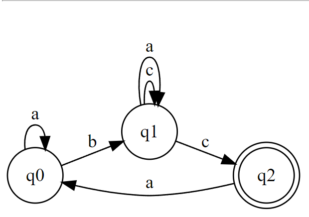

# Grammar-Based String Generation and Classification Report

This report provides an overview of a Java-based system designed for generating strings from a defined grammar and classifying the grammar based on Chomsky's hierarchy. The system consists of two main components: the `Grammar` class for defining and manipulating grammars and the `FiniteAutomaton` class for checking if a given string matches the grammar's rules.

## Objectives
This lab's primary objectives were to deepen our understanding of finite automata (FAs) and explore their practical applications, particularly in the context of grammar classification and conversion between different automata types. Specifically, we aimed to:

1. Understand what an automaton is and what it can be used for.
2. Implement a function in the Grammar class to classify grammars based on the Chomsky hierarchy.
3. Convert a finite automaton to a regular grammar.
4. Determine whether a finite automaton is deterministic or non-deterministic.
5. Convert a non-deterministic finite automaton (NDFA) to a deterministic finite automaton (DFA).
6. Optionally, represent the finite automaton graphically using external libraries or tools.

## Grammar Class

The `Grammar` class is central to this system, providing the functionality to define grammar rules, generate strings based on those rules, and classify the grammar according to Chomsky's hierarchy.

### Key Features

- **Rule Definition:** Allows adding production rules with a left and right part, representing the grammar's structure.
- **String Generation:** Generates strings by recursively replacing non-terminal symbols in the string with their corresponding rules until a predefined maximum length is reached or no non-terminal symbols remain.
- **Grammar Classification:** Classifies the grammar into one of Chomsky's four types based on the structure of its rules.

### Example Usage

```java
Grammar grammar = new Grammar();
grammar.addRule("S", "aS");
grammar.addRule("S", "bB");
grammar.addRule("B", "cB");
grammar.addRule("B", "d");
grammar.addRule("B", "aD");
grammar.addRule("D", "aB");
grammar.addRule("D", "b");

String generatedString = grammar.generateString("S");
System.out.println(generatedString);

String classification = grammar.classify();
System.out.println(classification);
```

In this example, the grammar is defined with a set of rules. The generateString method is then used to produce a string starting from the symbol "S". Finally, the grammar is classified to determine its type in Chomsky's hierarchy.
### Finite Automaton Class
The FiniteAutomaton class uses regular expressions to check if a given string can be generated by the grammar. This approach translates the grammar into a regex pattern, then matches input strings against this pattern.

### Key Features
1. Initialization with Grammar: Constructs a finite automaton based on a grammar by converting it to a regular expression.
2. String Checking: Determines whether a given string matches the grammar's pattern.

### Example Usage
```java
Grammar grammar = new Grammar();
// Assume grammar is defined as in the previous example

FiniteAutomaton automaton = new FiniteAutomaton(grammar);
boolean matches = automaton.checkString("aabbccdd");
System.out.println(matches);
```

In this example, a FiniteAutomaton is created based on a previously defined grammar. It then checks if the string "aabbccdd" is valid according to the grammar's rules.

### Grammar Classification
The classification method within the Grammar class determines the type of grammar based on the structure of its rules, adhering to Chomsky's hierarchy:

- **Type 3 (Regular Grammar):** All rules follow the format A → aB or A → a, where A and B are non-terminal symbols, and a is a terminal symbol.
- **Type 2 (Context-Free Grammar):** The left-hand side of each rule consists of a single non-terminal symbol, and the right-hand side can be any string of terminals and non-terminals.
- **Type 1 (Context-Sensitive Grammar):** The length of the right-hand side of the rule is greater than or equal to the length of the left-hand side, allowing for context-sensitive generation.
- **Type 0 (Unrestricted Grammar):** There are no restrictions on the form of the rules, allowing for the most general form of string generation.
The system provides a straightforward yet powerful means of defining grammars, generating strings, and classifying grammars, making it a valuable tool for exploring formal language theory and automata.

```java
private boolean isRegularRule(Rule rule) {
        // Regular rule: A → aB or A → a
        return rule.right.matches("^[a-z]([A-Z]?)$");
    }

    private boolean isContextFreeRule(Rule rule) {
        // Context-Free rule: Left side is a single non-terminal, right side can be anything
        return rule.left.length() == 1 && Character.isUpperCase(rule.left.charAt(0))
                && !rule.right.isEmpty(); // Simplified check
    }

    private boolean isContextSensitiveRule(Rule rule) {
        // Context-Sensitive rule: Length of right >= Length of left, and right side includes at least one non-terminal
        return rule.right.length() >= rule.left.length() && rule.right.matches(".*[A-Z].*");
    }
}
```

# Finite Automaton Converter: NDFA to DFA Report

This document provides an overview of the `FAConverter` Java program, designed to perform operations on finite automata (FA), including converting non-deterministic finite automata (NDFA) to deterministic finite automata (DFA), determining whether a given FA is deterministic or non-deterministic, and converting FA to regular grammar.

## FAConverter Class

The `FAConverter` class encapsulates the logic for manipulating finite automata. It includes nested classes, methods for conversion between NDFA and DFA, determining the type of FA, and converting FA to regular grammar.

### State Nested Class

Represents a state in the automaton. Each state has a name and a map of transitions, where each transition maps a character symbol to a set of states.

#### Key Methods:

- `addTransition(char symbol, State state)`: Adds a transition for the given symbol to the state.

### Main Methods

- `convertNDFAtoDFA(List<State> states)`: Converts a list of states representing an NDFA into a DFA. It initializes with the start state and iteratively processes each state's transitions to create a set of DFA states and their corresponding transitions.

- `convertToRegularGrammar(List<State> states)`: Converts the FA into a regular grammar by iterating over each state's transitions and printing out the grammar's production rules.

- `determineFA(List<State> states)`: Determines whether the provided FA is a DFA or an NDFA by checking the number of transitions for each symbol in each state.

### Usage Example

The main method provides a simple CLI for interacting with the FAConverter functionalities:

```java
public static void main(String[] args) {
    // Define states and transitions
    State q0 = new State("q0");
    State q1 = new State("q1");
    State q2 = new State("q2");
    q0.addTransition('a', q0);
    q0.addTransition('b', q1);
    q1.addTransition('c', q1);
    q1.addTransition('c', q2);
    q1.addTransition('a', q1);
    q2.addTransition('a', q0);

    List<State> states = Arrays.asList(q0, q1, q2);

    Scanner scanner = new Scanner(System.in);
    // CLI for selecting options
}
```



In this example, the program defines a simple NDFA with three states and transitions. It then provides a CLI for selecting the desired operation, such as converting the NDFA to a DFA, determining the type of FA, or converting the FA to a regular grammar.


## Conclusion 
Overall, the code demonstrates a practical application of core concepts from automata theory and formal language theory. By providing tools for converting between NDFA and DFA, determining the nature of an FA, and deriving regular grammars, the program serves as both an educational resource and a foundation for further computational theory research and applications.
